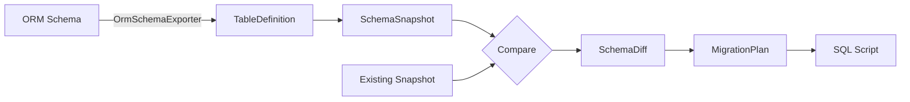

# Drizzle4Dotnet

> **A modern, type-safe SQL builder for .NET** — inspired by [Drizzle ORM](https://orm.drizzle.team) (TypeScript), built for .NET with compile-time safety, Native AOT compatibility, and multi-dialect support.

[](https://dotnet.microsoft.com/)
[](LICENSE)


---

## Table of Contents

- [Features](#features)
- [Dialects](#dialects)
- [Quick Start](#quick-start)
- [Usage Examples](#usage-examples)
  - [SELECT](#select)
  - [INSERT](#insert)
  - [UPDATE](#update)
  - [DELETE](#delete)
  - [Joins](#joins)
  - [Subqueries & CTEs](#subqueries--ctes)
  - [Upsert / On Conflict](#upsert--on-conflict)
- [Schema Definition](#schema-definition)
- [Source Generators](#source-generators)
- [CLI Tool](#cli-tool)
- [Migration System](#migration-system)
- [Documentation](#documentation)
- [Project Structure](#project-structure)
- [Building](#building)
- [License](#license)

---

## Features

| Feature | Description |
|---------|-------------|
| 🔒 **Type-safe queries** | Compile-time checked column types, table references, and result mappings |
| ⚡ **Fluent API** | Method-chaining query builder with `await` support |
| 🎯 **Multi-dialect** | PostgreSQL, MySQL/MariaDB, MSSQL, Oracle — single API |
| 🔧 **Source generators** | Roslyn incremental generators for table schemas, typed records, and mapping code |
| 🏗️ **Migration system** | Snapshot-based schema diffing and migration SQL generation |
| 📦 **CLI tool** | `drizzle4net` — generate, snapshot, apply, status commands |
| 🚀 **Native AOT** | Zero runtime reflection — all type mapping via generics + source gen |
| 📐 **Composable** | Subqueries, CTEs, recursive CTEs, compound queries, window functions |

---

## Dialects

| Dialect | Namespace | Status | Provider |
|---------|-----------|--------|----------|
| **PostgreSQL** | `Drizzle4Dotnet.PgSql` | ✅ Complete | Npgsql |
| **MySQL/MariaDB** | `Drizzle4Dotnet.MySql` | ✅ Complete | MySqlConnector |
| **SQL Server** | `Drizzle4Dotnet.Mssql` | ✅ Complete | Microsoft.Data.SqlClient |
| **Oracle** | `Drizzle4Dotnet.Oracle` | ✅ Complete | Oracle.ManagedDataAccess.Core |
| **SQLite** | `Drizzle4Dotnet.Sqlite` | 🚧 Planned | Microsoft.Data.Sqlite |

Each dialect provides:
- `{Dialect}DbClient` — database connection + execution
- `{Dialect}QueryBuilder` — offline SQL builder (for unit testing)
- `{Dialect}SqlDialectImpl` — dialect configuration (quoting, parameters, feature flags)
- `{Dialect}DataType` — CLR-to-SQL type mapping
- Dialect-specific functions, operators, and query extensions

---

## Quick Start

### Install

```bash
# Reference the project or NuGet package (once published):
dotnet add package Drizzle4Dotnet
```

### Define a Table Schema

```csharp
using Drizzle4Dotnet.Core.Schema.Columns;
using Drizzle4Dotnet.Core.Schema.Tables;
using Drizzle4Dotnet.PgSql;
using Drizzle4Dotnet.PgSql.Schema;

[Table("Users", "public", Dialect = typeof(PgSqlSqlDialectImpl))]
[Index("IX_Users_Email", ["Email"], IsUnique = true)]
public partial class UsersTable
{
    public static class Columns
    {
        [PgSqlBigInt]
        [Column("Id")]
        [PrimaryKey]
        public static long Id { get; set; }

        [PgSqlText]
        [Column("Name")]
        [NotNull]
        public static string Name { get; set; }

        [PgSqlText]
        [Column("Email")]
        [NotNull]
        public static string Email { get; set; }

        [PgSqlBoolean]
        [Column("IsActive")]
        [NotNull]
        public static bool IsActive { get; set; }
    }
}
```

### Build a Query

```csharp
using Drizzle4Dotnet.Core;
using Drizzle4Dotnet.PgSql;

// Offline builder (no DB connection)
var db = new PgSqlQueryBuilder();
var users = new UsersTable();

// OR online with real database:
await using var client = new PgSqlDbClient(connectionString);
var db = new PgSqlQueryBuilder(client);

// Build and await
List<(long Id, string Name)> results = await db
    .Select(users.Id, users.Name)
    .From(users)
    .Where(users.IsActive.Eq(true))
    .OrderBy(users.Name, asc: true)
    .Limit(10);
```

---

## Usage Examples

### SELECT

```csharp
// Basic SELECT
var query = db
    .Select(users.Id, users.Name, users.Email)
    .From(users)
    .Where(users.IsActive.Eq(true))
    .OrderBy(users.Name)
    .Limit(20)
    .Offset(0);

// SELECT DISTINCT
db.SelectDistinct(users.Name).From(users);

// SELECT with GROUP BY and HAVING
db.Select(users.DepartmentId, Functions.Count(users.Id))
    .From(users)
    .GroupBy(users.DepartmentId)
    .Having(Functions.Count(users.Id).Gt(5));

// SELECT with compound queries (UNION, INTERSECT, EXCEPT)
var active = db.Select(users.Id).From(users).Where(users.IsActive.Eq(true));
var admins = db.Select(users.Id).From(users).Where(users.RoleId.Eq(1));
var union = active.Union(admins);
```

### INSERT

```csharp
// Single row with generated InsertRecord
await db.Insert(users).Value(new UsersTable.InsertRecord(
    Name: "Alice",
    Email: "alice@example.com",
    IsActive: true
));

// Multiple rows
await db.Insert(users).Values(
    new UsersTable.InsertRecord(Name: "Alice", ...),
    new UsersTable.InsertRecord(Name: "Bob", ...)
);

// INSERT ... SELECT
await db.Insert(users).From(
    db.Select(archivedUsers.Name, archivedUsers.Email).From(archivedUsers)
        .Where(archivedUsers.IsActive.Eq(true))
);

// INSERT with RETURNING
var inserted = await db.Insert(users)
    .Value(new UsersTable.InsertRecord(Name: "Alice", ...))
    .Returning(users.Id, users.Name);
```

### UPDATE

```csharp
// Update with Set
await db.Update(users)
    .Set(users.Name, "Updated Name")
    .Set(users.IsActive, false)
    .Where(users.Id.Eq(1));

// Update with generated UpdateRecord (uses Optional<T>)
await db.Update(users)
    .Set(new UsersTable.UpdateRecord(Name: "New Name"))
    .Where(users.Id.Eq(1));

// Update with expression value
await db.Update(users)
    .Set(users.LoginCount, users.LoginCount.Add(1))
    .Where(users.Id.Eq(1));
```

### DELETE

```csharp
// Simple delete
await db.Delete(users).Where(users.Id.Eq(1));

// Delete with RETURNING
var deleted = await db.Delete(users)
    .Where(users.IsActive.Eq(false))
    .Returning(users.Id, users.Name);
```

### Joins

```csharp
// INNER JOIN
db.Select(users.Id, departments.Name)
    .From(users)
    .InnerJoin(departments, users.DepartmentId.Eq(departments.Id));

// LEFT JOIN, RIGHT JOIN, CROSS JOIN
db.Select(...).From(users)
    .LeftJoin(departments, users.DepartmentId.Eq(departments.Id));

// PostgreSQL-specific: LATERAL joins
db.Select(...).From(users)
    .InnerLateralJoin(subQuery, users.Id.Eq(subQuery.Field<long>("user_id")));

// MSSQL-specific: CROSS/OUTER APPLY
db.Select(...).From(users)
    .CrossApply(subQuery);
```

### Subqueries & CTEs

```csharp
// Subquery with typed columns
var subQuery = db.Select(users.Id, users.Name)
    .From(users)
    .Where(users.Age.Gt(18))
    .AsSubQuery("adults");

db.Select(subQuery.Field<long>("id"), subQuery.Field<string>("name"))
    .From(subQuery);

// Subquery with shape mapping
var shaped = query.AsSubQuery("s", f => new {
    UserId = f.Field<long>("id"),
    FullName = f.Field<string>("name")
});
db.Select(shaped.Shape.UserId, shaped.Shape.FullName).From(shaped);

// CTE from subquery
var cte = subQuery.AsCte();
db.Select(cte.Field<long>("id")).From(cte).With(cte);

// Recursive CTE
var recursiveCte = compoundQuery.AsRecursiveCte("org_tree");
db.Select(...).From(recursiveCte).WithRecursive(recursiveCte);
```

### Upsert / On Conflict

```csharp
// PostgreSQL: ON CONFLICT DO NOTHING
await db.Insert(users)
    .Value(new UsersTable.InsertRecord(Email: "alice@example.com", ...))
    .OnConflict("email")
    .DoNothing();

// PostgreSQL: ON CONFLICT DO UPDATE
await db.Insert(users)
    .Value(new UsersTable.InsertRecord(Email: "alice@example.com", Name: "Alice"))
    .OnConflict("email")
    .DoUpdate()
    .SetOnConflict(users.Name, "Updated Alice")
    .SetOnConflictExcluded(users.Email);

// MySQL: ON DUPLICATE KEY UPDATE
await db.Insert(users)
    .Value(new InsertRecord(...))
    .OnDuplicateKeyUpdate(users.Name, "Updated");

// MSSQL: MERGE
await db.Merge(users)
    .Using(source)
    .On(users.Id.Eq(source.Field<long>("id")))
    .WhenMatchedThenUpdate(new Dictionary<string, object?> { ["Name"] = "Updated" })
    .WhenNotMatchedThenInsert(new List<string> { "Name" }, new List<object?> { "New" });
```

---

## Schema Definition

### Table Attributes

| Attribute | Description |
|-----------|-------------|
| `[Table(name, schema)]` | Marks a class as database table |
| `[Alias(tableType, alias)]` | Self-join alias |
| `[Virtual]` | Virtual table (subquery/CTE) |

### Column Attributes

| Attribute | Description |
|-----------|-------------|
| `[Column(name)]` | Maps property to DB column |
| `[PrimaryKey]` | Primary key column |
| `[NotNull]` | NOT NULL constraint |
| `[Nullable]` | Forces nullable |
| `[DefaultValue("expr")]` | Default value expression |
| `[AutoIncrement]` | Auto-increment/identity |
| `[Check("expr")]` | CHECK constraint |
| `[Comment("text")]` | Column comment |

### Constraint Attributes (Table-Level)

| Attribute | Description |
|-----------|-------------|
| `[ForeignKeyKeyConstraint(name, cols, foreignTable, fcols)]` | FOREIGN KEY (repeatable) |
| `[UniqueConstraint(cols)]` | UNIQUE constraint (repeatable) |
| `[PrimaryKeyTableConstraint(cols)]` | Composite PRIMARY KEY (repeatable) |
| `[CheckTableConstraint(expr)]` | CHECK constraint (repeatable) |
| `[Index(name, cols)]` | Database index (repeatable) |

### Generated Schema Output

Each `[Table]` class generates:
- `DbColumn<T, TTable, TDialect>` static properties for each column
- `ColumnNames` static class with column name constants
- `InsertModel` / `InsertRecord` (typed insert records)
- `UpdateModel` / `UpdateRecord` (typed update records with `Optional<T>`)
- `SelectResult` / `SelectModel` (pre-built result types)
- `GeneratedSubqueryTable` / `GeneratedCteTable` (subquery/CTE support)

---

## Source Generators

Three Roslyn incremental generators produce strongly-typed code at compile time:

| Generator | Input | Output |
|-----------|-------|--------|
| [`TableGenerator`](SourceGenerators/SourceGenerators/TableGenerator.cs) | `[Table]` + `[Column]` classes | Table classes with `DbColumn` properties, `InsertRecord`/`UpdateRecord`, subquery tables |
| [`DbSelectGenerator`](SourceGenerators/SourceGenerators/DbSelectGenerator.cs) | `[DbSelect]` classes + `TypedTupleSelectedColumns` (1–16) | `ISelection<TModel,TRecord>` with `.Record` and `.Mapping` |
| [`MigrationSchemaGenerator`](SourceGenerators/SourceGenerators/MigrationSchemaGenerator.cs) | Table types with schema attributes | Migration C# code with embedded SQL |

---

## CLI Tool

The `drizzle4net` CLI tool provides migration management:

```bash
# Generate migration from table types
drizzle4net generate --provider pgsql --name v1 --types "MyApp.UsersTable,MyApp.DepartmentsTable"

# Generate with auto-discovery + auto-name
drizzle4net generate --provider pgsql

# Create schema snapshot
drizzle4net snapshot --provider pgsql --name v1 --output ./snapshot.json

# Show migration status
drizzle4net status --provider pgsql --output ./Migrations/pgsql

# Apply pending migrations
drizzle4net apply --provider pgsql --connection "Host=localhost;Database=mydb"
```

---

## Migration System

The migration pipeline works through snapshot diffing:



```csharp
// Extract schema from table types
var snapshot = OrmSchemaExporter.CreateSchemaSnapshot<PgSqlSqlDialectImpl>(
    "v2", typeof(UsersTable), typeof(DepartmentsTable));

// Load existing snapshot
var existing = SchemaSnapshot.Deserialize(File.ReadAllText("snapshot.json"));

// Generate diff and migration plan
var diff = existing.Compare(snapshot);
var plan = diff.ToMigrationPlan("v2");
var sql = plan.ToSql<PgSqlSqlDialectImpl>();

// Write migration files
File.WriteAllText("Migrations/pgsql/0002_v2.sql", sql);
File.WriteAllText("Migrations/pgsql/0002-snapshot-v2.json", snapshot.Serialize());
```

---

## Documentation

| Document                               | Description |
|----------------------------------------|-------------|
| [`class.md`](class.md)                 | Comprehensive class hierarchy and design documentation |
| [`feature.md`](feature.md)             | Complete feature inventory with all functions, operators, dialect syntax |
| [`design-review.md`](design-review.md) | Design strengths, weaknesses, and recommendations |
| [`test-report.md`](test-report.md)     | Test coverage report and implementation plan |
| [`PLAN-pgsql.md`](PLAN-pgsql.md)             | PostgreSQL implementation status |
| [`PLAN-mssql.md`](PLAN-mssql.md)       | MSSQL implementation status |
| [`PLAN-mysql.md`](PLAN-mysql.md)       | MySQL implementation status |
| [`PLAN-oracle.md`](PLAN-oracle.md)     | Oracle implementation status |
| [`PLAN-sqlite.md`](PLAN-sqlite.md)     | SQLite implementation plan |

---

## Project Structure

```
Drizzle4Dotnet/
├── Drizzle4Dotnet/                       # Main library project
│   └── src/
│       ├── Core/                         # Core library (dialect-agnostic)
│       │   ├── DbClient.cs               # Abstract DB client + transaction support
│       │   ├── Query/                    # Query builders (Select, Insert, Update, Delete, Compound, Returning)
│       │   │   ├── Select/               #   SelectQuery.cs
│       │   │   ├── Insert/               #   InsertQuery.cs, IInsertRecord.cs
│       │   │   ├── Update/               #   UpdateQuery.cs, IUpdateRecord.cs
│       │   │   └── Delete/               #   DeleteQuery.cs
│       │   ├── Schema/
│       │   │   ├── Columns/              # Column types + attributes (IColumn, DbColumn, VirtualColumn)
│       │   │   ├── Tables/               # Table types + attributes (ITable, Attributes)
│       │   │   └── Migration/            # Migration system (DDL, snapshot, diff, comparer)
│       │   │       └── Query/            #   DDL query builders (CreateTable, AlterTable, etc.)
│       │   ├── Shared/                   # Core interfaces (ISql, ISqlDialect, IQueryExecutor, ISelectedColumns, etc.)
│       │   └── Operators/               # SQL operators + functions + expression nodes (AST)
│       │       └── Nodes/               #   Expression node types (BinaryNode, FunctionCallNode, etc.)
│       ├── PgSql/                        # PostgreSQL implementation
│       │   ├── PgSqlDbClient.cs
│       │   ├── PgSqlQueryBuilder.cs
│       │   ├── PgSqlSqlDialectImpl.cs
│       │   ├── PgSqlStatics.cs
│       │   ├── Schema/                   # PgSqlColumn, PgSqlDataType, PgSqlTable
│       │   ├── Operators/                # PgSqlFunctions, PgSqlOperators
│       │   │   └── Nodes/
│       │   └── Query/                    # PgSqlSelectQuery, PgSqlInsertQuery, etc.
│       ├── MySql/                        # MySQL/MariaDB implementation
│       ├── Mssql/                        # MSSQL implementation
│       └── Oracle/                       # Oracle implementation
├── Drizzle4Dotnet.Cli/                   # CLI tool (Program.cs + Commands/ + Services/)
├── SourceGenerators/
│   └── SourceGenerators/                 # Roslyn incremental generators
│       ├── TableGenerator.cs             # [Table] → DbColumn, InsertRecord, UpdateRecord, SubqueryTable
│       ├── DbSelectGenerator.cs          # TypedTupleSelectedColumns + [DbSelect] processing
│       ├── MigrationSchemaGenerator.cs   # Migration C# code generation
│       └── Utils.cs                      # Shared helpers
├── SharedDemo/                           # Demo schema definitions (all dialects)
│   ├── PgSql/
│   ├── MySql/
│   ├── Mssql/
│   └── Sqlite/
├── Test/                                 # NUnit test suite
│   ├── Select/                           # PgSqlSelectTests, MySqlSelectTests, CompoundQueryTests
│   ├── Insert/                           # PgSqlInsertTests, MySqlInsertTests
│   ├── Update/                           # PgSqlUpdateTests, MySqlUpdateTests
│   ├── Delete/                           # PgSqlDeleteTests, MySqlDeleteTests
│   ├── Merge/                            # PgSqlMergeTests
│   └── Migration/                        # PgSqlMigrationTests
├── Benchmark/                            # Performance benchmarks
│   ├── Benchmark.csproj
│   └── Program.cs
├── Demo1/                                # Demo application
├── Migrations/                           # Sample migration output (per dialect)
│   └── pgsql/
└── docs/                                 # Documentation (class.md, feature.md, design-review.md, test-report.md, PLAN*.md)
    (root level: *.md)
```

---

## Building

```bash
# Restore and build
dotnet restore Drizzle4Dotnet.sln
dotnet build

# Run tests
dotnet test

# Run benchmarks
dotnet run -p Benchmark/Benchmark.csproj -c Release

# Pack for NuGet
dotnet pack -c Release
```

---

## License

MIT License — see [LICENSE](LICENSE) for details.
